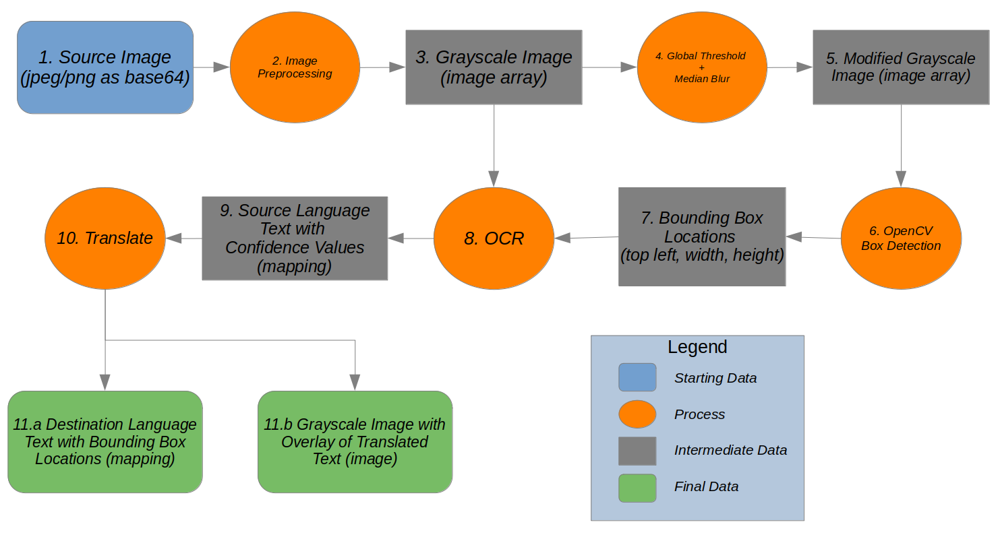

# Developer Documentation

## Pipeline Description 

1. We start with a source image, passed to the API via JSON. The image is base64 encoded and stored in the "b64ddata" key of the JSON object. 

2. Next we do image preprocessing on the source image when we construct the `ImageWrapper` object so we can manipulate the data more easily. 

3. By default, we grayscale the image in the `ImageWrapper` constructor, since it saves space and the OCR works better on grascaled images. We also standardize the size of the image (in case the submitted image is too small for the OCR and box detection to be accurate). 

4. We apply global thresholding and median blur before adaptive thresholding to better single out boxes of text in the image.

5. This modified grayscale image is only being used in the following step for box detection, and will be discarded once that process is complete.

6. Here we use `OpenCV` to find the bounding boxes for text in the image.

7. Bounding Box Locations are of the format (top, left, width, height) in pixels.

8. `PyTesseract` performs OCR on each of the bounding boxes locations of the Grayscale Image from step 3.

9. The OCR output is the source language text with confidence values based on what `PyTesseract` thinks is in the text box.

10. Translation is done by trained opus langauge models from `HuggingFace` in combination with the python `transformers` library.

11. a. The final output is a JSON object with translations of each found text box from the source image, along with the source language text, and the location of the box on the source image.  

12. b. A secondary final output is an image with the translated text overlayed at the bounding box locations.

## Tuning OCR Detection

`src/api.py` uses `src/hieroglyph/process/boxes.py` to determine the method of performing OCR detection of foreign language text using the **INBOUND_IMAGE_TYPE** enumerator class defined in `src/hieroglyph/__init__.py`.

Dependent on the API endpoint used, a different INBOUND_IMAGE_TYPE value is automatically applied to the document (or image) that has entered the pipeline.


### OCR for Text

The `pipeline/` endpoint invokes the **TEXT_BASED** enumerator value from **INBOUND_IMAGE_TYPE** which triggers thresholding in `boxes.py` optimized for documents which primarily contain paragraph-based text.

Below are the current settings:

```py
kernel = cv2.getStructuringElement(cv2.MORPH_CROSS, (4, 4))
dilated_thresh = cv2.dilate(inverted_binary_image, kernel, iterations=12)
contours, _ = cv2.findContours(dilated_thresh, cv2.RETR_EXTERNAL, cv2.CHAIN_APPROX_NONE)
```

`pipeline/` uses **Simple Thresholding**, meaning for every pixel, the same "threshold value" is applied. Thresholding segments images into objects. The values to adjust are:

* In the kernel variable: `cv2.MORPH_CROSS` and `(4, 4)` 

* In the dilated_thresh variable: `iterations=12`

* In the contours, _ variable: `cv2.RETR_EXTERNAL` and `cv2.CHAIN_APPROX_NONE`

Reference the OpenCV2 documentation for details on their definitions.

As a start, adjustments have been most successful when moving the iterations integer up or down and adjusting the tuple in kernel.

### OCR for Diagrams

The `ocr/` endpoint invokes the **DIAGRAM_BASED** enumerator value from **INBOUND_IMAGE_TYPE** which triggers thresholding in `boxes.py` optimized for network-diagrams. Below are the current settings:

```py
thresh = cv2.adaptiveThreshold(inverted_binary_image, 255, cv2.ADAPTIVE_THRESH_GAUSSIAN_C, cv2.THRESH_BINARY_INV, block, 8)
contours, _ = cv2.findContours(thresh, cv2.RETR_EXTERNAL, cv2.CHAIN_APPROX_NONE)
```

`ocr/` uses **Adaptive Thresholding** which is capable of handling images with different lighting conditions in different areas. The algorithm determines the threshold for a pixel based on a small region around it. So we get different thresholds for different regions of the same image which gives better results for images with varying illumination.  

In order to better accomodate different size images/diagrams of different densities we attempt to determine the most appropriate `block` value. We do this by trying every odd value from 5 to 37 and when successive incremented `block` values produce similar values for the number of boxes found and average proximity between boxes. This has given us the best text boxes across diagrams with differing densities.
