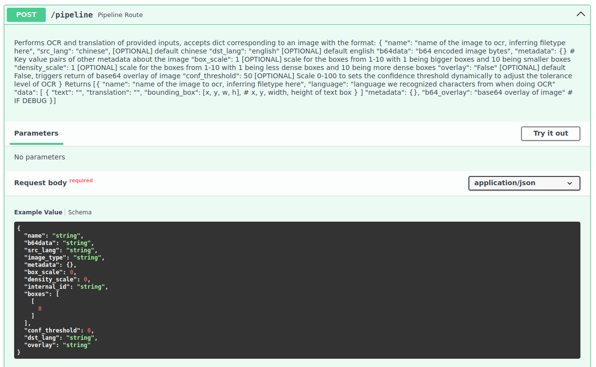

# Hieroglyph

Hieroglyph is an API-Based, Optical Character Recognition (OCR) and language translation pipeline capable of performing the following tasks:

* Process One or More Images
* Process One or More PDFs *(Auto-Converts Each Pg. to an Image)*
* Pre-Process Assets to Improve the Quality of OCR
* Identify and Outline Boxes of Foreign Language Text
* Translate All Identified Foreign Language Text
* Replace Foreign Language Text with English Translations

The platform uses the latest HuggingFace Machine Learning Translation Models for **Chinese Simplified** and **Russian** and is readily compatible with other languages.

### Who is this for?

Hieroglyph is intended for users with a need for fully offline OCR capabilities with no commercial telemetry, as such this guide is tailored for audiences with two compute environments:

- an offline environment (i.e., a desired place of operation for Hieroglyph) 

- an online environment (i.e., a seperate internet-connected machine).

> This guide assumes users have permissions to move files between environments.

### Requirements

* python 3.11+
* docker-compose 1.29+
* docker 24+

### Table of Contents

- [Installation](#installation)

- [Getting Started](#getting-started)

- [Web GUI Guide](#web-gui-guide)

- [Backend API Guide](#backend-api-guide)

## Installation

Once a user has cloned the hieroglyph repository to their local offline machine, there are two options to complete setup and installation of the platform:

- [Building from Tarball](#option-a---building-from-tarball)

- [Building from Scratch](#option-b---building-from-scratch)

Follow the guide below for the option applicable to you:

### Option A - Building from Tarball

If a complete tarball (`hieroglyph_deploy.tar.gz`) has been provided to you, deployment consists of five simple steps.

1. Drag and drop the tarball into the `hieroglyph/build/` directory

2. From the terminal enter the build directory `cd build/`

3. Execute `./stage-4-deploy.sh`

4. Go back to the main hieroglyph directory and create a .env file `touch .env`

```ini
FRONTEND_PORT=3001
BACKEND_HOST=localhost
DATABASE_USER=<your_db_username_here>
DATABASE_PASSWORD=<your_db_password_here>
DATABASE_PORT=27017
RUSSIAN_PORT=8089
CHINESE_PORT=8088
```

5. Run the platform using `docker-compose up`

Verify the terminal looks similar to the following after `docker-compose up`:

```shell
svc-chi_1  | INFO:     Uvicorn running on http://0.0.0.0:8088
# ... Trimmed for Brevity
svc-chi_1  | INFO:     Started server process [10]
svc-chi_1  | INFO:     Waiting for application startup.
svc-chi_1  | INFO:     Application startup complete.
```

### Option B - Building from Scratch

1. Enter the hieroglyph `build/` directory with `cd build/`

2. In your offline environment, execute `./stage-1-bundler.sh` which creates a tarball for the next stage of the build process. Move the tarball to your online environment.

3. In your online environment, untar the tarball and execute the shell script preloaded with the folder `./stage-2-internet.sh`. Wait for completion to receive `STAGE_THREE_BUNDLE.tar.gz`

4. Move the new tarball `STAGE_THREE_BUNDLE.tar.gz` to your offline environment in the `hieroglyph/build/` directory.

5. In your offline environment, execute `./stage-3-offline.sh` (ensure `STAGE_THREE_BUNDLE.tar.gz` is in the build directory). This stage will also generate a tarball named `hieroglyph_deploy.tar.gz` which contains the complete docker containers which can be shared with any subsequent machines to facilitate a simpler installation process for Hieroglyph following the instructions in [Option A](#option-a---building-from-tarball).

6. At this stage, Hieroglyph is ready to be deployed. Go back to the main hieroglyph directory and create a .env file `touch .env`

```ini
FRONTEND_PORT=3001
BACKEND_HOST=localhost
DATABASE_USER=<your_db_username_here>
DATABASE_PASSWORD=<your_db_password_here>
DATABASE_PORT=27017
RUSSIAN_PORT=8089
CHINESE_PORT=8088
```

## Getting Started

On any platform with `docker-compose` installed, open the terminal:

> The following assumes the user has possession the hieroglyph_deploy.tar.gz  and 

```sh
cd hieroglyph/build/
./stage-4-deploy
```

Alternatively, users can load and start the containers manually:

```sh
cd hieroglyph/build/
docker load --input mongo_latest.tar.gz
docker load --input hieroglyph_frontend_latest.tar.gz
docker load --input hieroglyph_server_latest.tar.gz
cd ..
docker-compose up
```

Verify the terminal looks similar to the following after `docker-compose up`:

```shell
svc_1  | INFO:     Uvicorn running on http://0.0.0.0:8088
# ... Trimmed for Brevity
svc_1  | INFO:     Started server process [10]
svc_1  | INFO:     Waiting for application startup.
svc_1  | INFO:     Application startup complete.
```

If start-up was successful, the API will instantly be active in the background with documentation hosted locally **offline** and viewable at http://0.0.0.0:8088/docs.


Navigate to http://localhost:3001/ to view the Web GUI to upload documents (e.g., text or diagram), execute OCR extraction, and translate detected content.


## Web GUI Guide

Once you have navigated to [http://localhost:3001/](http://localhost:3001/) to view the Web GUI, select:

- 'Options' > 'Select File'

Choose a source image to process, if you do not have one to begin with, look in the `hieroglyph/assets/examples/` folder for simple exemplars of Chinese and Russian diagram or text-centric content.


If you have selected a Chinese, text-centric, source image configure the following:

- 'Options' > 'Select Language' > 'Chinese'

- 'Options' > 'Select Image Type' > 'Text'

- 'Options' > 'Process Current Page'


Once Hieroglyph has completed OCR, the detected text will be loaded in the right-hand pane. Once loaded, select the blue 'Translate' button on the right-hand side under 'Stage: OCR/Translate'.


Once the translation has been generated, users can export the data to a variety of mediums such as a CSV file, a database record (by default saves to the MongoDB docker service packaged with Hieroglyph), or a new document with the translation overlaid ontop of the foreign language text for easy viewing.

Simply navigate to 'Export Options' in the top-right corner and select one of the following options:

- Export Data To File

- Save State To Database

- Generate Overlay Picture


If 'Export Data To File' is selected a pop-up will appear. Select whether the CSV should only include a single page or all pages of the document and click 'Export'.


## Backend API Guide

The Web GUI is available for ease of use, however, some users may wish to interact with the API directly to leverage 3rd party or custom applications. The following sections will direct users to the API endpoint documentation and provide examples regarding how to use it directly.

* [Instructions for Submitting Plain Text](#submitting-plain-text)

* [Instructions for Submitting Documents and Images](#submitting-documents-and-images)

### Submitting Plain Text

Navigate to API Web Page at http://0.0.0.0:8088/docs 

1. Expand the Tab labeled **POST /translate Translate Route** and click 'Try it out'


In the `Request Body` section:

2. Replace the `string` in the line `text: "string"` with any Chinese Simplified Text

> *Example (Copy & Paste):* 人员和与值排班管理、电子巡检、移动APP管理、知识库管理、流程管理、维护保养、维修管理、应急演练、机房进出登记和供应商管理

3. Replace the `"string"` in the line `src_lang: "string"` with **"Chinese"**
4. Replace the `"string"` in the line `dst_lang: "string"` with **"English"**
5. Press the **Execute** Button to Submit
6. Scroll down and view the translation in the `Response Body Section`:


You will see the following translation of the example previously shown:

> ```json
> "result": "Personnel and shift management, electronic inspection, mobile APP management, knowledge base management, process management, maintenance and maintenance, maintenance and maintenance management, emergency drills, air room log-in and vendor management"
> ```

7. **Repeat Steps 1 - 6** for Russian text, only the `dst_lang` must be changed.

### Submitting Documents and Images

Navigate to API Web Page at http://0.0.0.0:8088/docs 

`/pipeline` is the core endpoint for handling requests, it accepts a single document or image, and steps it through the full Hieroglyph OCR and translation process. Applications can iteratively submit requests to process multiple documents, however for large volumes of documents `/batch-pipeline` can accept larger requests containing multiple documents or images all at once.



`/batch-pipeline` is capable of handling multiple documents and images at the same time by submitting a list of objects to the endpoint. It's expected parameters are very similar to `/pipeline`, see below:


### Built-In Utility for Testing

In the `scripts/` directory `submitter.py` is a python utility built to easily package, send, and return translations of PDFs and other source documents to Hieroglyph for user testing and evaluation.

```
usage: hieroglyph/scripts/submitter.py

options:
  -h, --help            show a help message and exit
  -i INPUT              Full input file path to submit
  -u URL                HTTP URL of the endpoint to send data
  -s SRC_LANG           Source language for input file(s)
  -d DST_LANG           Destination language for input file(s)
  -f ENDPOINT           API endpoint to use (text,diagram,translate)
  -o                    Output a new document with the translation overlaid
  -od OUTPUT_DIR        Directory to output overlaid documents
```

#### Quick Walkthrough

Enter the `scripts/` directory in the hieroglyph repository with `cd scripts`

For Chinese Simplified Language documents simply use the following command:

```shell
python submitter.py -i <input_file_path> -u http://0.0.0.0:8088 -s chinese -d english -f text
```

> The above assumes the Hieroglyph docker service is running and the Chinese language container is running on your localhost on port 8088. Change accordingly!

Example using the four-page PDF in `/assets/cn_newsfeeds/News_One.pdf`:

```shell
python submitter.py -i hieroglyph/assets/cn_newsfeeds/News_One.pdf -u http://0.0.0.0:8088 -s chinese -d english -f text -o -od .
```

#### Detailed Walkthrough

As an example, we'll use the simplified chinese PDF `News_One.pdf` in the `assets/cn_newsfeeds` directory. To OCR the Chinese text to English using the Hieroglyph Chinese Docker container running locally on the default of `http://0.0.0.0:8088`, use the following command:

```shell
python submitter.py -i hieroglyph/assets/cn_newsfeeds/News_One.pdf -u http://0.0.0.0:8088 -s chinese -d english -f text -o -od .
```

The script will split each page of the PDF into a `*.png` image in its origin directory (in this case, `assets/cn_newsfeeds`), automically build the JSON objects for each page, and send a POST Request to the appropriate container endpoint with the object until all pages are submitted.

The terminal running the Hieroglyph container will begin processing OCR identified text:

```sh
# ... Trimmed for Brevity
hieroglyph-chi_1 | DEBUG: [translator] Translation Request: chi_sim+chi_tra -> eng: 本身就是一種.
hieroglyph-chi_1 | DEBUG: [translator] Returning the final result to the user, see below: 
hieroglyph-chi_1 |  ['China News Network']
```

The terminal that executed submitter.py will look like this:

```sh
# ... Trimmed for Brevity
DEBUG    [MainThread] Writing image data for News_One.3.png
INFO     [MainThread] Finished writing image: News_One.3.overlay.png
INFO     [MainThread] Dumping 1 responses to .
DEBUG    [MainThread] Writing image data for News_One.4.png
INFO     [MainThread] Finished writing image: News_One.4.overlay.png
```

Once the script completes processing, the OCR output is saved as multiple images in your current directory. Following the example you will see the following generated files for each page in the `News_One.pdf` file:

```
News_One.1.overlay.png
News_One.2.overlay.png
News_One.3.overlay.png
News_One.4.overlay.png
```

## Appendix

### Docker Compose Variables

The docker-compose.yml provides defines a number of environmental variables that are not controlled by the `.env` file, see below for definitions.

> Typically only `WORKER_COUNT` should ever require modification (depending on user preferences). Any environmental variables prefixed with a dollar sign (`$`) are controlled by the `.env` file.

- `MODEL_DIR` : Input directory containing the translation models
- `DATA_DIR` : Output directory used by the /batch-pipeline endpoint to write JSON results from OCR and translation
- `INIT_LANG` : The foreign langauage the API should expect (corresponds to the languages supported by the translation models)
- `INIT_PORT` : The local network port to run the API
- `WORKER_COUNT` : The number of concurrent workers to stand-up. Used by the `/pipeline` endpoint to distribute multiple requests for parallel processing of documents. Leverage this setting to vertically scale the API.
  
  > The recommended maximum number of workers for WORKER_COUNT is generally (Number of Cores x 2 + 1)

### Endpoint Descriptions

Documentation of expected data types and returns are viewable at the generated `/docs` endpoint. The following describes the purpose and use-case of each endpoint.

> User Note: As an input, the current version of the API by default expects images (PNGs, JPEGs, JPG) in base64 format. To support PDFs, users need to use their API client-side script to split PDFs into individual images. This is readily supported in the open domain with Python libraries such as pdf2image. If you need assistance, contact the application developers.

#### /pipeline

Asynchronous endpoint capable of receiving simultaneous requests and processing them concurrently to perform OCR and Translation. Each individual incoming request is expected tohave only one document or image provided.

**Target Use Case:** A user has a large volume of media that must be processed concurrently to expedite OCR and translation speeds. The user writes an API client script to send multiple files in individual requests.

**Constraint:** Only limited by the available CPU cores of the API server and the number of workers (defined in the `docker-compose.yml`) to maximize those cores. Requires API clients capable of handling asynchronous requests and responses (can be provided upon request). Users need to be able to handle scenarios where all workers are busy.

#### /translate

Synchronous endpoint which only translates raw foreign language text and does not OCR.

**Target Use Case:** A user possesses foreign language in a plaintext form and wishes to quickly receive a rapid offline translation.

**Constraint:** N/A

#### /batch-status

An informational endpoint which returns the status of jobs being worked on by the `/batch-pipeline` endpoint.

#### /ocr

Synchronous endpoint which only performs OCR of media and does not translate content.

**Target Use Case:** (a) Users who are fluent in a foreign language or (b) Users who wish to leverage OCR text extraction for their own translation pipeline(s).

**Constraint:** N/A

#### /batch-pipeline

Asynchronous endpoint which will accept a single request with multiple files, processing them quietly in the background one at a time, keeping track of completions, and writing the generated translations of OCR'd content to the `/data` directory (defined in the `docker-compose.yml`). Uses a SQLite database to track job status.

**Target Use Case:** A user has a large volume of media to process in a "set and forget" manner (i.e., not sensitive to time). The user wishes to periodically check-in on progress and receivefiles as they're completed.

**Constraint:** Extends processing times but is friendlier to simpler API clients (can be provided upon request), reducing development burden on the user. Constrained by memory available to the host system.

#### Informational Endpoints

The root / endpoint is used to validate the API is running successfully while the /info endpoint is used to provide information on the currently loaded translation models.

### Handling Large Data Sets

> Warning: When working with large PDF-based document sets, the provided submitter script converts each page of the the PDF into an image file for OCR processing. Users are advised to have a minimum amount of disk space that is at least **twice the size of their PDF based dataset**. Otherwise, once each PDF is expanded, disk space will become strained at best.